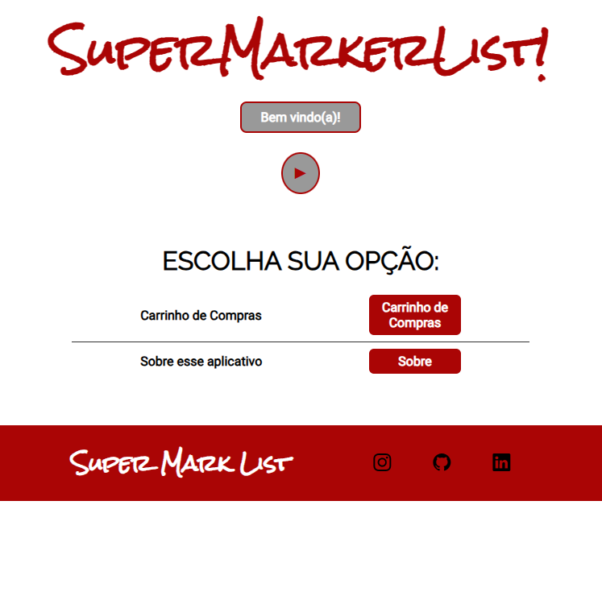
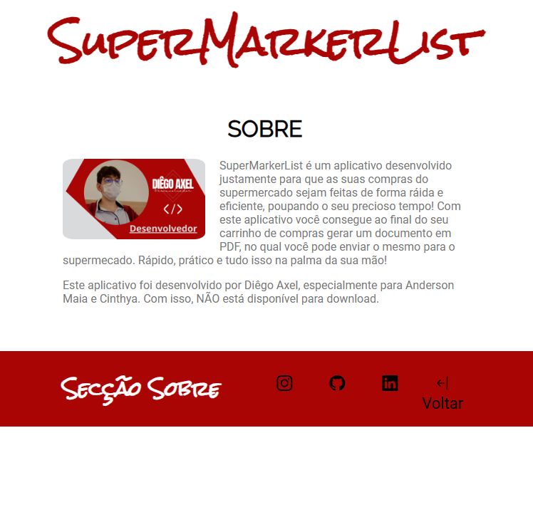

  

App Desenvolvido para cliente, para fazer uma lista de Supermercado pelo celular.

  <a href="#-projeto">Projeto</a>&nbsp;&nbsp;&nbsp;|&nbsp;&nbsp;&nbsp;
  <a href="#-tecnologias">Tecnologias</a>&nbsp;&nbsp;&nbsp;|&nbsp;&nbsp;&nbsp;
  <a href="#-sobre">Sobre</a>

 

  
  

## 🚀 Tecnologias

Esse projeto foi desenvolvido com as seguintes tecnologias:

- HTML
- CSS
- JavaScript

## Sobre

- App desenvolvido por demanda de cliente em específico -> Feito para as NECESSIDADES dele, do jeito que ele quis. Aqui só tem uma PEQUENA parte do código, como esse é um aplicativo que um cliente me encomendou, eu não irei colocar ele por completo aqui por motivos óbvios e maiores. Não atualizarei mais nada por aqui, 90% do código continuara privado. Obrigado pela compreensão.

